# 浙江省教考院高/选/学考成绩查询助手

适用于[浙江教育考试院成绩查询系统](http://cx.zjzs.net)。

## 特点

快速查询浙江省教考院公布的高考/选考/学考成绩，操作速度快，并可以将本次查询的所有人的数据导出为 CSV 格式，方便收集整理。

## 简单的使用方法

 1. 运行程序，在“设置与帮助”中设置好参数。

 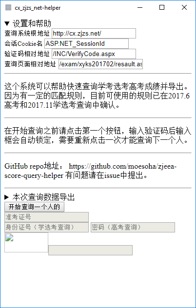

 一般来说，“查询系统根地址”、“会话 Cookie 名”、“验证码相对地址”不会改变，主要是“查询页面相对地址”，你可以在查询系统中通过查看源代码找到。如果找地址有问题，我建议你通过咨询信息老师解决。

 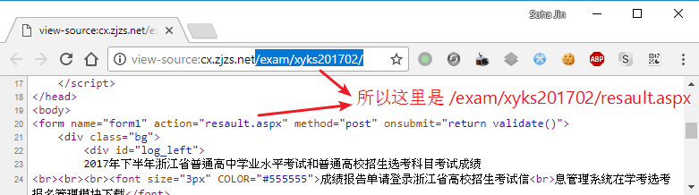
 
 2. 点击按钮“开始查询一个人的”。输入准考证号、身份证号*（春秋季的学考/选考）*或者密码*(夏季的高考)*，验证码输满 4 位后会自动查询，如有错误会给出提示。一般来说非验证码错误都可能是程序逻辑需要更新，请报告*（报告时请带上参数，即“查询系统根地址”、“会话 Cookie 名”、“验证码相对地址”、“查询页面相对地址”）*。

 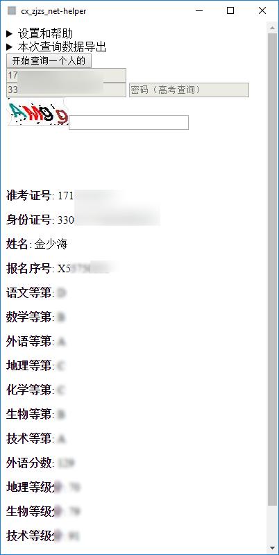

 3. 要查询另一个人的只需要再点击一次按钮，每一次查询记录都会保存到内存中，关闭窗口后没有存储的数据会消失。

 4. 要保存当前查询到的所有结果请点击“本次查询数据导出”。在对应的文件选择框中选择一个保存路径，然后点击“保存”，提示保存成功的时候即可。CSV 格式的导出时间在数据多的情况下可能会长达几秒。同时对于大部分用户我们建议使用 CSV 。

 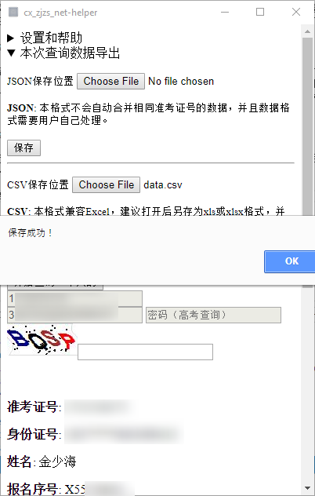

## CSV 与 Excel

因为中文环境的 Office 在打开未知代码页的文件时会自动使用中国国家标准（GB）定义的代码页，就会出现乱码的问题（如图），那么这时候需要手动导入 CSV 避免这个问题。

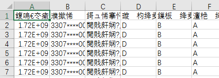

下面的操作环境均为 Excel 2016 (en_US)，其他版本以及 WPS 请自行根据下面的教程融会贯通。

 1. 新建一个工作簿，选择**“数据” > “导入外部数据” > “从文本导入”**，并选中 CSV 文件，点击**“导入”**。

 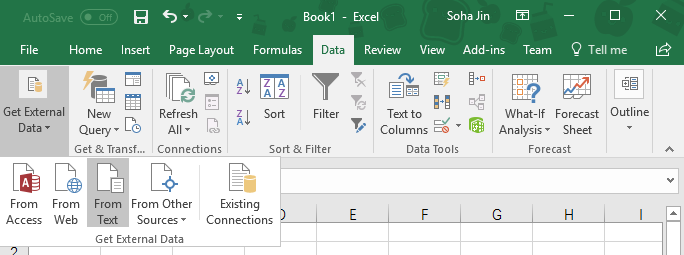

 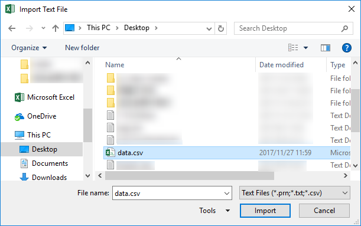

 2. 在自动打开的对话框中“原始数据类型”选择“限定”，下面代码页选择 **“65001 : Unicode (UTF-8)”**，随后下一步。第二步中，选中**“逗号”**，文本限定符选用 `"` *（双引号）*，这是我们可以看见下面的预览中已经有了有结构的数据了，下一步。第三步可以指定每一列的数据格式，你可以选择不管它，Excel 会自动帮你决定。

 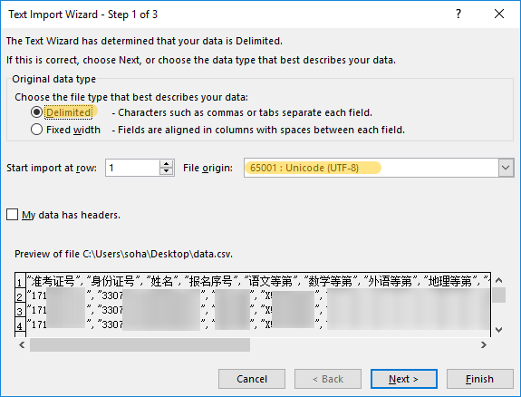

 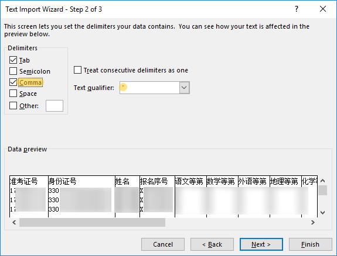

 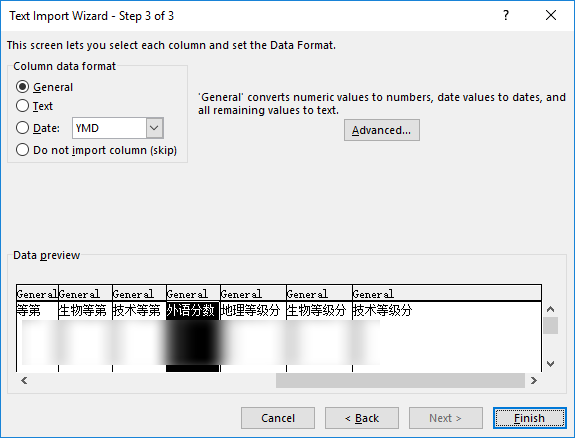

 3. 这时会叫你选择导入数据的起始位置，默认就是 `$A$1`，一般也不需要改变，点击完成即可。

 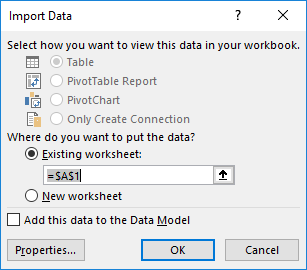

 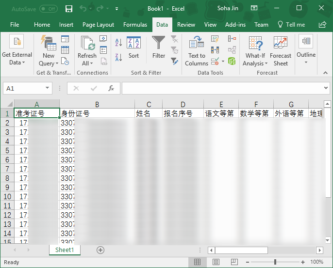
